Tests of normality on residuals
================
Rodolfo Pelinson
2024-09-23

\#Should we apply normality and heterocedasticity tests on the raw data
or on residuals of the model?

The quick answer is: on the residuals.

Here is an example:

Lets create a response variable “y” that is normally distributed, but is
also dependent on a two factor categorical predictor “x” of levels “A”
and “B”. We should have 50 observations of the response variable for
each level of x. Level A will have an expected value of 25, and level B
an expected value of 75, both with a constant standard deviation of 15.

``` r
set.seed(1)
y_A <- rnorm(n = 50, mean = 25, sd = 15)
y_B <- rnorm(n = 50, mean = 75, sd = 15)

y <- c(y_A, y_B)

x <- c(rep("A", 50), rep("B", 50))
```

If we plot an hitogram of the response variable y we will see that it
has two peaks.

``` r
hist(y, breaks = seq(from = min(y), to = max(y), length.out = 10))
```

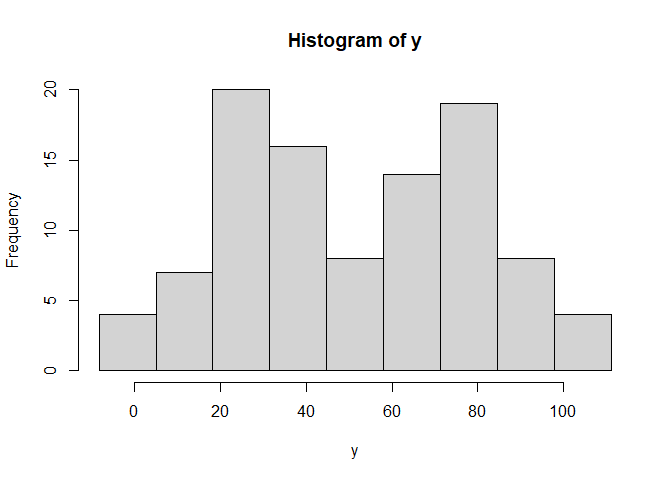<!-- -->

It doesn\`t really look a normally distributed data, even though the
data was generated from a normal distribution.

If we apply the Shapiro-Wilk normality test we will see that this data
is indeed significantly different from a expected normal distribution.

``` r
shapiro.test(y)
```

    ## 
    ##  Shapiro-Wilk normality test
    ## 
    ## data:  y
    ## W = 0.96348, p-value = 0.007177

This is because our data was not generated from a single normal
distribution, but two! We have two categories, A and B, and this must be
accounted for! We could test whether A and B alone are normally
distributed:

First A

``` r
hist(y_A, breaks = seq(from = min(y_A), to = max(y_A), length.out = 10))
```

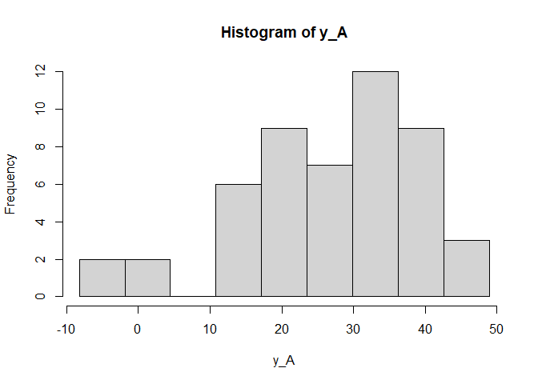<!-- -->

``` r
shapiro.test(y_A)
```

    ## 
    ##  Shapiro-Wilk normality test
    ## 
    ## data:  y_A
    ## W = 0.96399, p-value = 0.1306

Appears to also be normally distributed.

Now B.

``` r
hist(y_B, breaks = seq(from = min(y_B), to = max(y_B), length.out = 10))
```

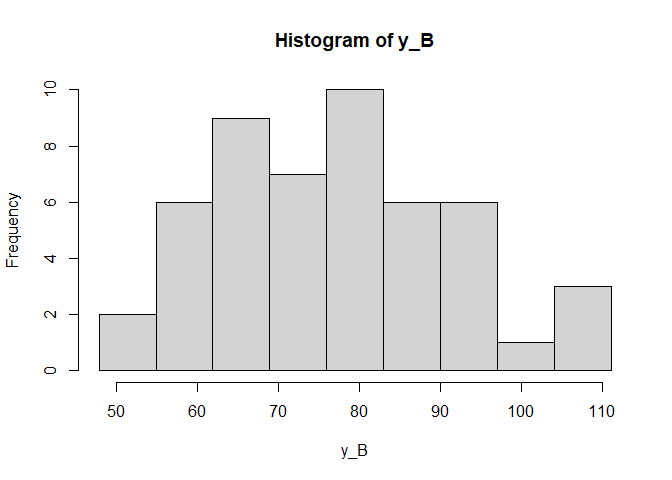<!-- -->

``` r
shapiro.test(y_B)
```

    ## 
    ##  Shapiro-Wilk normality test
    ## 
    ## data:  y_B
    ## W = 0.98451, p-value = 0.7505

But, this is hard to do for more complex models and the more efficitent
way to do this is by testing normality on the residuals of a model that
assumes that errors (or residuals) are normally distributed. This is
because the residuals are free from the effect of the predictor x as
they force A and B to have the same expected value, which is zero.

``` r
mod <- lm(y~x)
resid <- residuals(mod)

hist(resid)
```

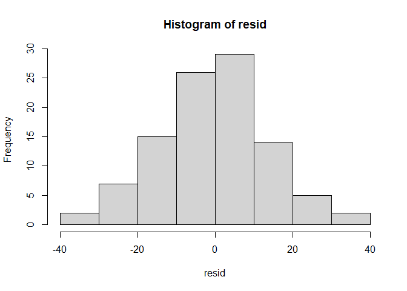<!-- -->

``` r
shapiro.test(resid)
```

    ## 
    ##  Shapiro-Wilk normality test
    ## 
    ## data:  resid
    ## W = 0.9956, p-value = 0.9877

As we can see, residuals are beautifully normally distributed, showing
that data from both A and B levels come from a normal distributed.

A better way to see that is by inspecting residual plots:

``` r
plot(mod)
```

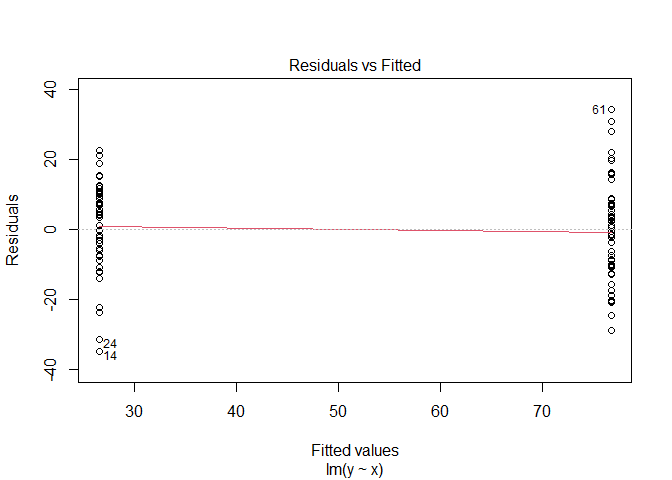<!-- -->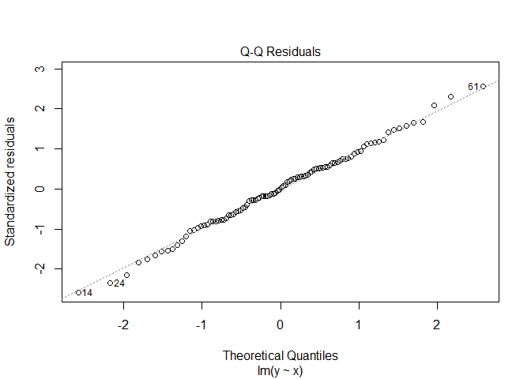<!-- -->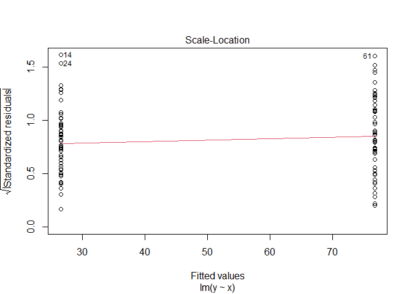<!-- -->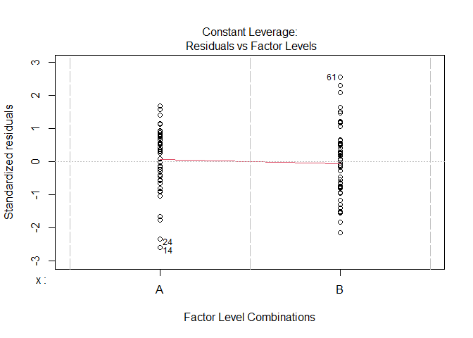<!-- -->

Here residuals VS fitted values shoud show no clear paterns, such as
different variabilities, as they do not.

QQplot shoud show that observed quantiles are reasonably similar to
expected ones (close to the theoretical diagonal line), as they are.

If we include a predictor that does not affect the response, we may also
see problems on this plot.

``` r
wrong_x <- rep(c("A","B"),50)

mod_wrong <- lm(y ~ wrong_x)

wrong_resid <- residuals(mod_wrong)

hist(wrong_resid)
```

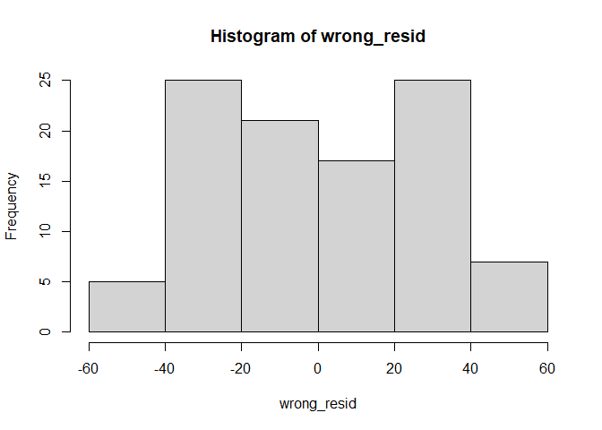<!-- -->

``` r
shapiro.test(wrong_resid)
```

    ## 
    ##  Shapiro-Wilk normality test
    ## 
    ## data:  wrong_resid
    ## W = 0.96175, p-value = 0.005369

``` r
plot(mod_wrong)
```

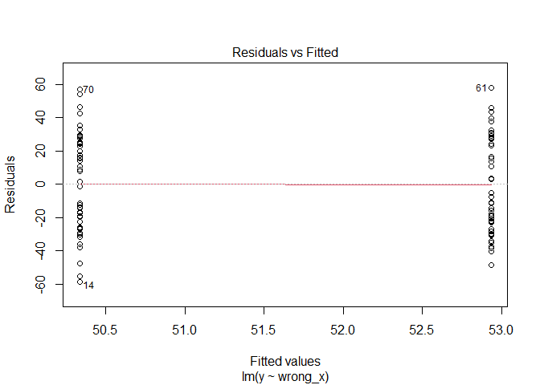<!-- -->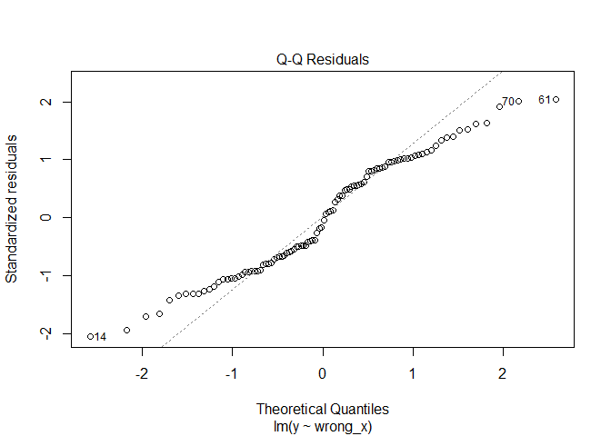<!-- -->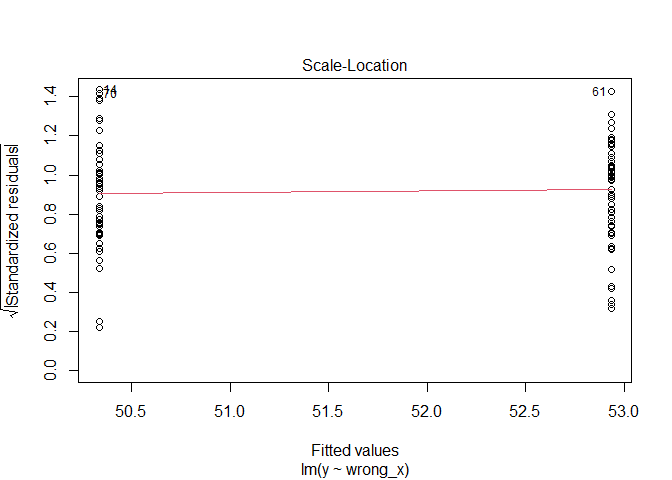<!-- -->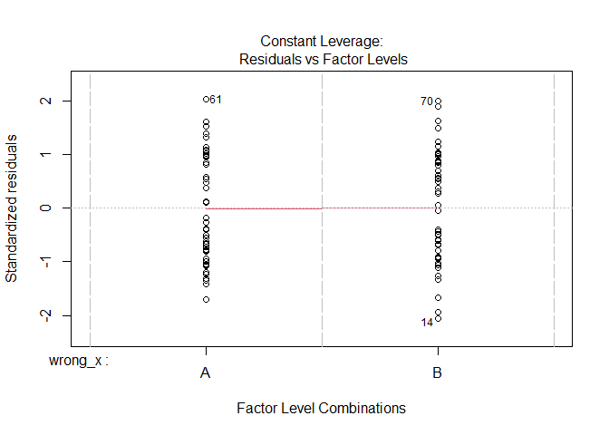<!-- -->

Look how to QQPlot are missbehaved.

Now that we know that data is normally distributed, we may proceed and
test the hypothesis that A have a different expected value than B. It
has and it is probably highly significant.

``` r
anova(mod)
```

    ## Analysis of Variance Table
    ## 
    ## Response: y
    ##           Df Sum Sq Mean Sq F value    Pr(>F)    
    ## x          1  63135   63135  344.32 < 2.2e-16 ***
    ## Residuals 98  17969     183                      
    ## ---
    ## Signif. codes:  0 '***' 0.001 '**' 0.01 '*' 0.05 '.' 0.1 ' ' 1

Just for curiosity

``` r
anova(mod_wrong)
```

    ## Analysis of Variance Table
    ## 
    ## Response: y
    ##           Df Sum Sq Mean Sq F value Pr(>F)
    ## wrong_x    1    169  168.89  0.2045 0.6521
    ## Residuals 98  80935  825.86
