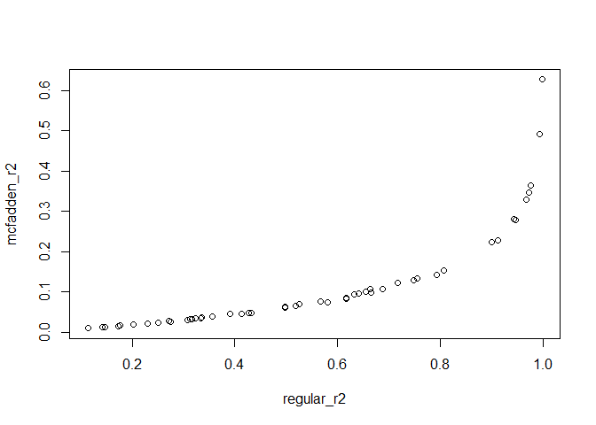

R² and Pseudo R²
================
Rodolfo Pelinson
2024-10-11

We first will simulate a linear effe between two variables.

``` r
x <- runif(50, min = 0, max = 100)
y <- rnorm(50, mean = 10 + 1.5*x, sd = 30)

plot(y ~ x)
```

<!-- -->

Now lets compute the regular coefficient of determination, including
using a function from package MuMIn

``` r
model <- lm(y~x)
model0 <- lm(y~1)

regular_r2 <- summary(model)$r.squared
mcfadden_r2 <- c(1 - (logLik(model)/logLik(model0)))
LR_r2 <- (deviance(model0) - deviance(model))/ deviance(model0)

#Another way to compute if we do not have access to the deviance

n<-length(y)

LR_r2_2 <- 1 - exp( - (2/n)  * ( (logLik(model)) -  logLik(model0) ) )

#Package MuMIn has a function to calculate LR R²
library(MuMIn)
LR_r2_3 <- r.squaredLR(model)

regular_r2
```

    ## [1] 0.6352171

``` r
LR_r2
```

    ## [1] 0.6352171

``` r
LR_r2_2
```

    ## 'log Lik.' 0.6352171 (df=3)

``` r
LR_r2_3
```

    ## [1] 0.6352171
    ## attr(,"adj.r.squared")
    ## [1] 0.6352293

``` r
mcfadden_r2
```

    ## [1] 0.09288576

Now lets simulate some scenarios and see how things vary according to a
large variation in r² values.

``` r
sds <- runif(50, max = 100, min = 1)

regular_r2 <- rep(NA, 50)
mcfadden_r2 <- rep(NA, 50) 
LR_r2 <- rep(NA, 50)
  
for (i in 1:50){
  x <- runif(50, min = 0, max = 100)
  y <- rnorm(50, mean = 10 + 1.5*x, sd = sds[i])
  
  model <- lm(y~x)
  model0 <- lm(y~1)

  regular_r2[i] <- summary(model)$r.squared
  mcfadden_r2[i] <- c(1 - (logLik(model)/logLik(model0)))
  LR_r2[i] <- (deviance(model0) - deviance(model))/ deviance(model0)
}

plot(mcfadden_r2 ~ regular_r2)
```

<!-- -->

``` r
plot(LR_r2 ~ regular_r2)
```

<!-- -->

Likelyhood R² seems to make a better job in terms of linear scaling and
similarity to absolute values. But it has a problem of having a maximum
of less than 1 for logistic regression. the function r.squaredLR from
the MuMIn package offers a correction.
